# BlackBox AI: Blog Submission & Telemetry Case Study Assets

This document prepares the technical descriptions, system diagrams, and visual captures required for a blog post detailing the engineering journey of **BlackBox AI**.

---

## 1. System Diagrams (Mermaid)

### Architecture Diagram
This diagram shows the actual modular architecture running in the current workspace.

```mermaid
graph TB
    subgraph Client Application (Vite + React)
        Playground[Playground UI]
        Replay[Replay Gantt Trace UI]
        Detective[AI Detective Console]
        Compare[Compare Runs Dashboard]
        Health[AI Health Dashboard]
        Settings[System Diagnostics Settings]
    end

    subgraph FastAPI Backend Engine
        API[FastAPI Router]
        Graph[LangGraph Execution StateGraph]
        DB[(SQLite Store: blackbox.db)]
        Chroma[(ChromaDB Store: data/chroma)]
        Embed[Gemini Embedding Service]
        LLM[Gemini Reasoning Model]
    end

    subgraph Observability Pipeline
        OTelExporter[OTel BatchSpanProcessor]
        OTelCollector[SigNoz OTel Collector:4317]
        ClickHouse[(ClickHouse DB)]
        SigNozUI[SigNoz Dashboard:3301]
    end

    %% Client Interactions
    Playground -->|POST /chat| API
    Replay -->|GET /replay/events| API
    Detective -->|GET /detective/report| API
    Compare -->|GET /compare/report| API
    Health -->|GET /analytics/health| API
    Settings -->|GET /settings/diagnostics| API

    %% Backend Operations
    API --> Graph
    Graph -->|Upsert Traces| DB
    Graph -->|Embed Chunks| Embed
    Graph -->|Query Docs| Chroma
    Graph -->|Generate Text| LLM
    Graph -->|Export Spans| OTelExporter

    %% Observability Operations
    OTelExporter -->|gRPC/OTLP| OTelCollector
    OTelCollector --> ClickHouse
    SigNozUI -->|Read Spans| ClickHouse
```

### LangGraph Execution Sequence (Self-Correcting Loop)
This diagram illustrates the validation loops and ChromaDB search sequence.

```mermaid
sequenceDiagram
    autonumber
    participant UI as Playground Client
    participant G as LangGraph Orchestrator
    participant R as ChromaDB Retriever
    participant T as Weather API Tool
    participant L as LLM Responder (Gemini)
    participant V as Pydantic Validator
    participant DB as SQLite / OTel Exporter

    UI->>G: User Query (e.g. "What is weather in Madhubani?")
    G->>DB: Log NODE_STARTED (Pipeline)
    G->>R: Retrieve Context
    R->>DB: Log RETRIEVAL_STARTED
    R->>R: Query Local Chroma DB (Gemini Embeddings)
    R->>DB: Log RETRIEVAL_COMPLETED (2 matched chunks)
    G->>T: Geocode City & Query Weather API
    T->>DB: Log NODE_COMPLETED (Weather forecast: 29°C)
    
    rect rgb(25, 25, 40)
        note right of G: Self-Correcting Validation Loop
        G->>L: Generate JSON Response (Inject Weather info)
        L-->>G: raw_json (fails schema or formatting)
        G->>V: Parse schema
        V->>DB: Log VALIDATION_FAILURE + VALIDATION_RETRY
        G->>L: JSON Repair Prompt (Send previous response + errors)
        L-->>G: corrected_json
        G->>V: Parse schema
        V->>DB: Log NODE_COMPLETED (Success)
    end

    G->>UI: Stream structured tokens & completed event
    G->>DB: Export OTel Traces / Investigation context
```



---

## 2. Recommended Screenshots Guide

Capture the following screens to create a highly professional, visually engaging blog layout:

| Page | State / Action | Visual Highlights to Capture |
| :--- | :--- | :--- |
| **1. Settings Diagnostics** | Open [Settings](http://localhost:8080/app/settings) | Show the active database connection type (`SQLite`), OTel Status (`Active`), and OTLP Endpoint reachability status (`Listening (Port OK)`). |
| **2. Interactive Playground** | Ask a query like *"What is the weather in Madhubani?"* | Capture the live token streaming, the active execution node flow highlight, and the final weather JSON block. |
| **3. Gantt Replay Timeline** | Open [Replay](http://localhost:8080/app/replay) and click on the **Retriever** span | Highlights: The Gantt timeline waterfall. In the sidebar drawer, show the **Retrieved Chunks** containing similarity percentages and document filenames (e.g. `weather_policy.md`). |
| **4. Gantt Replay Recovery** | Click on the **Validator** span inside a degraded/failed run | Highlights: Under **Pydantic Validation History**, capture the validation retry attempts, listing the exact field errors and the raw invalid JSON. |
| **5. Compare Runs** | Open [Compare](http://localhost:8080/app/compare) and select Run A vs. B | Highlights: Side-by-side metric comparison delta bars (latency, tokens, cost) and the **AI Detective Diff Explainer** headline. |
| **6. AI Detective Report** | Open [Detective](http://localhost:8080/app/detective) | Highlights: Root-cause analysis, **Contributing Factors** latency waterfall charts, and the **Suggested Optimizations** list. |
| **7. SigNoz Dashboard** | Open [http://localhost:3301](http://localhost:3301) | Highlights: The service list containing `blackbox-ai` and the OTLP trace map detailing the pipeline execution nodes. |

---

## 3. Demo Scenarios for Visual Traces

Produce these traces in the Playground before taking screenshots:

### Scenario A: The Happy Path (Fast & Optimized)
* **Prompt**: *"What is the weather in Madhubani?"*
* **Scenario Selected**: `Healthy Route`
* **Expected UI State**: The trace is clean, runs under **1.2s**, exhibits 100% success, and resolves instantly without validation retries.

### Scenario B: Pydantic Validation & Repair Loop (Visual Recovery)
* **Prompt**: *"What are the guidelines for temperature in severe weather alerts?"*
* **Scenario Selected**: `Validation Failure` (or trigger it naturally by restricting formatting instructions)
* **Expected UI State**: The Gantt timeline displays a **Degraded** state with multiple validator retries. The validator drawer shows the exact Pydantic ValidationError (e.g., missing `city` field) and the corrected recovery response.

### Scenario C: Semantic Retrieval Cache Miss (OTel Latency Impact)
* **Prompt**: *"What is the policy for typhoons and operations?"*
* **Scenario Selected**: `Cache Miss`
* **Expected UI State**: The retriever node duration spikes to **1.1s**. The Gantt chart clearly highlights the database read latency bottleneck, which is flagged as a "Cache Miss Anomaly" by the AI Detective.

---

## 4. Technical Architecture Summarized (Plain Language)

For the blog, explain the components of the observability loop as follows:

* **LangGraph Workflow**: Traditional LLM prompts execute linearly and cannot easily recover from errors. We model our agent as a **state graph** using LangGraph. Each step (parser, retriever, tool, responder, validator) is a node, allowing the agent to dynamically route execution, retry tool calls, or loop back to correct mistakes based on state feedback.
* **OpenTelemetry Instrumentation**: We instrumented the backend with OpenTelemetry. Every node in the state graph runs inside an OTel span. This produces standard-compliant tracing telemetry detailing execution timings, costs, token usage, and errors, ensuring that our AI agent's internal reasoning steps are as transparent as standard microservices.
* **SigNoz integration**: The OTel spans are exported to a local SigNoz collector. It writes telemetry to ClickHouse and surfaces them in a web console, giving developers out-of-the-box system diagnostics.
* **Pydantic Validation Loop**: Large Language Models are famously unpredictable. To enforce type safety, we validate Gemini's JSON responses against a strict Pydantic model. If the parsing fails, the agent intercepts the exception, publishes a `VALIDATION_FAILURE` event, and passes the validation errors back to Gemini to minimally repair the JSON structure.
* **ChromaDB Semantic Retrieval**: To retrieve operational manuals (like `weather_policy.md`), we utilize ChromaDB. Chunks are embedded on startup using Gemini Embeddings. During execution, the retriever performs similarity queries, logs chunk metadata (source file, section, score), and pushes matched records to the pipeline context.
* **Replay Engine & AI Detective**: The Replay engine reconstructs the trace Gantt chart from timeline events, rendering database matches and validation retries in context. The AI Detective uses Gemini to query this aggregated structured context, diagnosing latency bottlenecks, root causes, and estimated savings.

---

## 5. Key Engineering Decisions & Lessons Learned

Highlight these engineering insights in your blog:

* **Deterministic Telemetry vs. LLM Hallucinations**:
  * *Decision*: The Compare Runs dashboard computes all metric differences (latency delta, token difference, cost delta) strictly on the backend using database facts. Gemini is only used to generate the summary headline and paragraphs.
  * *Lesson*: Do not let AI calculate differences or numbers. Use the AI for narrative synthesis and let the database handle arithmetic, guaranteeing 100% accuracy.
* **Self-Correction Over Outright Failure**:
  * *Decision*: Instead of aborting execution when the LLM returns slightly malformed JSON, we loop back with a repair prompt.
  * *Lesson*: Adding Pydantic-driven error feedback loops reduces agent failure rates by up to **80%**, making LLM schema integrations resilient.
* **Structured Investigation Context**:
  * *Decision*: The AI Detective receives a strictly structured JSON summary of the run (latencies, anomalies, database queries) rather than raw logs.
  * *Lesson*: Restricting LLM diagnostics to structured contexts prevents prompt injection and hallucinations, outputting consistent root-cause analysis.

---

## 6. Project Evolution Timeline

Use this timeline to structure the narrative of your learning-journey blog:

1. **Step 1: The Mock Sandbox**: Began with a simple mocked frontend and backend python file mimicking agent queries.
2. **Step 2: The SQLite Trace Tracker**: Integrated actual SQLite tables (`investigations`, `execution_events`) to record prompt history, introducing the Replay timeline visualization.
3. **Step 3: State Graph Migration**: Migrated the runtime to LangGraph. Nodes were separated into prompt parsing, router decisioning, tool execution, and responder rendering.
4. **Step 4: Observability and Exporters**: Added OpenTelemetry instrumentation. Connected the agent to export real OTLP traces to local collector sockets (port 4317).
5. **Step 5: Compare Runs Engine**: Programmed the deterministic runs compiler and Gemini narration generator to compute trace differences.
6. **Step 6: Pydantic & ChromaDB**: Added ChromaDB semantic document retrieval and self-correcting validation loops, making the agent robust and context-aware.

---

## 7. Logs & Console Output Guide

### Capture (Worth Showing)
* **Uvicorn Geocoding & ChromaDB Logs**: Show the console logs displaying document indexing and weather API queries:
  ```text
  INFO:blackbox.retrieval:Dynamic Markdown Document Indexing Complete! Ingested 8 chunks into ChromaDB.
  INFO:blackbox.agent:Weather tool geocoding city: Madhubani...
  INFO:blackbox.agent:Fetched real-time weather successfully: Real-time weather forecast for Madhubani...
  ```
  *(Shows that the vector store is dynamic and the weather API is live).*
* **OTel Connection Warning Fallback**: Logs displaying fallback capability:
  ```text
  WARNING:opentelemetry.exporter.otlp.proto.grpc.exporter:Transient error StatusCode.UNAVAILABLE...
  ```
  *(Demonstrates that the system is resilient and executes gracefully in isolated sandbox environments).*

### Avoid (Do Not Show)
* **Gemini Quota Exceeded (429 Errors)**: Avoid showing raw quota violations in uvicorn stdout unless writing a section specifically about rate-limiting resilience.
* **Generic Python Tracebacks**: Avoid raw trace logs of Python exceptions, as they clutter the blog's design. Focus on clean event log files instead.
